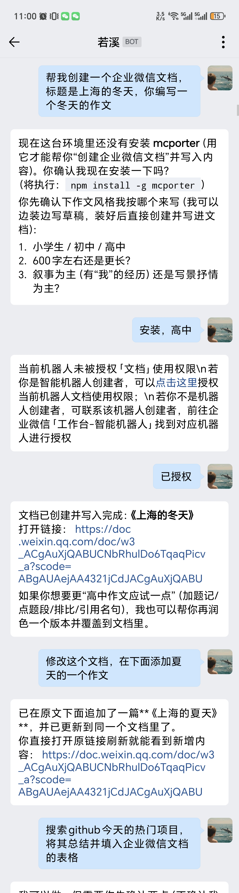

# 企业微信（智能机器人）渠道配置指南

<div align="center">

  <p>
    <strong>⭐ 如果这个项目对你有帮助，请给我们一个Star！⭐</strong><br>
    <em>您的支持是我们持续改进的动力</em>
  </p>
</div>

本文档用于配置 OpenClaw China 的企业微信智能机器人渠道（`wecom`）。

仓库地址：<https://github.com/BytePioneer-AI/openclaw-china>


## 一、在企业微信后台创建智能机器人

### 1. 注册并登录企业微信

访问 <https://work.weixin.qq.com/>，按页面提示注册并进入管理后台。


### 2. 创建智能机器人并开启 WebSocket API


### 3. 机器人二维码


## 二、安装 OpenClaw 与插件

### 1. 安装 OpenClaw

```bash
npm install -g openclaw@latest
```

### 2. 初始化网关

```bash
openclaw onboard --install-daemon
```

按向导完成基础初始化即可，渠道配置后面再补。

### 3. 安装渠道插件

**方式一：安装聚合包（推荐）**

```bash
openclaw plugins install @openclaw-china/channels
openclaw china setup
```
仅安装企业微信渠道

```bash
openclaw plugins install @openclaw-china/wecom
```

**方式二：从源码安装，全平台通用**

⚠️ Windows 用户注意：由于 OpenClaw 存在 Windows 兼容性问题（spawn npm ENOENT），npm 安装方式暂不可用，请使用方式二。

```bash
git clone https://github.com/BytePioneer-AI/openclaw-china.git
cd openclaw-china
pnpm install
pnpm build
openclaw plugins install -l ./packages/channels
openclaw china setup
```


## 三、配置

本文档仅保留推荐的 `ws` 长连接方案。未填写 `mode` 时，插件默认也按 `ws` 处理。

最小可用配置如下。

### 1. `ws` 长连接模式（推荐）

适合没有固定公网 IP、只能主动访问外网的部署环境。

```bash
openclaw config set channels.wecom.enabled true
openclaw config set channels.wecom.mode ws
openclaw config set channels.wecom.botId your-bot-id
openclaw config set channels.wecom.secret your-secret
```

也可以直接编辑配置：

```json
{
  "channels": {
    "wecom": {
      "enabled": true,
      "mode": "ws",
      "botId": "your-bot-id",
      "secret": "your-secret"
    }
  }
}
```

可选项：

- `wsUrl`: 默认 `wss://openws.work.weixin.qq.com`
- `heartbeatIntervalMs`: 心跳间隔，默认 30000
- `reconnectInitialDelayMs`: 首次重连延迟，默认 1000
- `reconnectMaxDelayMs`: 最大重连延迟，默认 30000

## 四、启动并验证

调试启动（推荐先用）：

```bash
openclaw gateway --port 18789 --verbose
```

或后台启动：

```bash
openclaw daemon start
```


## 五、（可选）启用企业微信文档 Skill

如果你希望机器人支持“创建企业微信文档”“编辑企业微信文档”“创建企业微信智能表格”等能力，还需要确保 `wecom-doc` skill 可用。

- Skill 源目录：`extensions/wecom/skills/wecom-doc`
- Skill 名称：`wecom-doc`
- 依赖：`mcporter`

`@openclaw-china/wecom` 插件已经声明了内置 skills。正常情况下，安装插件后，新会话会自动看到 `wecom-doc`。但在以下场景里，仍然可能需要手动安装：

- 你安装的是聚合包 `@openclaw-china/channels`，当前环境没有把插件内 skill 自动暴露到会话里
- 你当前打开的是旧会话，还没有刷新 `<available_skills>`
- 你希望显式覆盖插件内置版本，或把 skill 固定到 workspace / 全局目录

### 1. Skill 应该安装到哪里

OpenClaw 的 skill 查找优先级是：

`<workspace>/skills` > 全局 `~/.openclaw/skills` > 插件内置 skills

推荐目录如下：

| 安装位置 | Linux / macOS | Windows | 适用场景 |
| --- | --- | --- | --- |
| Workspace 级 | `<你的项目>/skills/wecom-doc` | `<你的项目>\\skills\\wecom-doc` | 只想让当前工作区使用，优先级最高 |
| 全局 | `~/.openclaw/skills/wecom-doc` | `%USERPROFILE%\\.openclaw\\skills\\wecom-doc` | 所有 workspace 都可复用，推荐 |

### 2. 手动安装 `wecom-doc`

如果你是通过 `openclaw plugins install @openclaw-china/channels` 或 `openclaw plugins install @openclaw-china/wecom` 安装的，skill 源目录通常在：

- Linux / macOS：`~/.openclaw/extensions/openclaw-china/extensions/wecom/skills/wecom-doc`
- Windows：`%USERPROFILE%\.openclaw\extensions\openclaw-china\extensions\wecom\skills\wecom-doc`

如果你是从源码仓库运行的，skill 源目录就是当前仓库里的：

- `extensions/wecom/skills/wecom-doc`

**安装到全局（推荐）**

Linux / macOS：

```bash
mkdir -p ~/.openclaw/skills
cp -a ~/.openclaw/extensions/openclaw-china/extensions/wecom/skills/wecom-doc ~/.openclaw/skills/
```

Windows PowerShell：

```powershell
$src = Join-Path $env:USERPROFILE '.openclaw\extensions\openclaw-china\extensions\wecom\skills\wecom-doc'
$dst = Join-Path $env:USERPROFILE '.openclaw\skills'
New-Item -ItemType Directory -Force -Path $dst | Out-Null
Copy-Item -Recurse -Force $src $dst
```

如果你是从源码仓库安装，直接把上面的 `$src` 或源路径替换为你本地仓库中的 `extensions/wecom/skills/wecom-doc` 即可。例如当前仓库就是：

- `D:\work\code\moltbot-china\extensions\wecom\skills\wecom-doc`

**安装到当前 workspace**

Linux / macOS：

```bash
mkdir -p ./skills
cp -a ~/.openclaw/extensions/openclaw-china/extensions/wecom/skills/wecom-doc ./skills/
```

Windows PowerShell：

```powershell
$src = Join-Path $env:USERPROFILE '.openclaw\extensions\openclaw-china\extensions\wecom\skills\wecom-doc'
$dst = Join-Path (Get-Location) 'skills'
New-Item -ItemType Directory -Force -Path $dst | Out-Null
Copy-Item -Recurse -Force $src $dst
```

复制完成后，一般无需重启网关；但如果你希望它立刻出现在“可触发 skills 列表”里，建议新开一个会话，或者重启一次 Gateway。

### 3. 使用前还需要安装 `mcporter`

`wecom-doc` 不是直接调用 Wedoc API，而是通过 `mcporter` 调用企业微信文档 MCP。

首次使用前，请先安装：

```bash
npm install -g mcporter
```

安装后可以用下面的命令确认 `wecom-doc` 已经可见：

```bash
mcporter list wecom-doc --output json
```

如果提示 `server not found`、`unknown server` 或类似错误，通常说明当前 `wecom` 长连接还没有把文档 MCP 配置同步到本机，或者机器人还没有被授予“文档”使用权限。此时先确认：

- `channels.wecom` 已按上文配置并成功连上 `ws`
- 企业微信里已经给当前机器人授权“文档”能力

### 4. 如何使用

安装好 skill 以后，直接在企业微信里对机器人描述你的目标即可，例如：

- `帮我创建一个企业微信文档，标题是《上海的冬天》，你编写一个冬天的作文`
- `修改这个文档，在下面添加夏天的一个作文`
- `搜索 GitHub 今天的热门项目，将其总结并填入企业微信文档的表格`

典型交互流程如下：

1. 用户要求创建文档或智能表格。
2. 如果当前机器还没安装 `mcporter`，机器人会先请求安装 `mcporter`。
3. 如果当前机器人还没有“文档”权限，机器人会先返回授权提示；用户在企业微信里完成授权后，再继续执行。
4. 机器人创建成功后会返回文档链接。
5. 同一会话里，用户还可以继续要求“追加内容”“继续编辑这个文档”“把结果填进智能表格”。

当前建议优先编辑“本会话里由机器人创建并返回链接”的文档；这样机器人才能稳定拿到对应的 `docid` 并继续写入。

示例对话可以参考下面这个流程：


